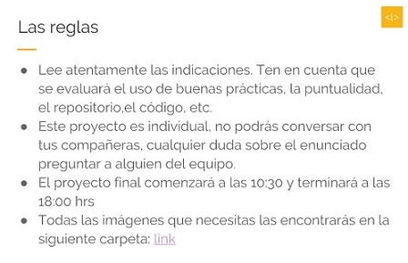
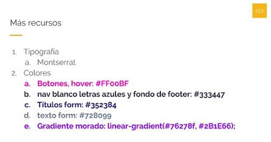

# Code Review | Lyft

## El proyecto
Se realizó un code review del:
Proyecto final del Sprint3 del Bootcamp de Laboratoria < l >

La consigna fue realizar a página web de Lyft.

## Criterios de evaluación

## Recursos

## Lyft: contenido

### Nav
El nav tiene la siguiente particularidad:
Al bajar, este contenido debe pasar de ser transparente a color blanco y el botón <kbd>Sign Up</kbd>, debe aparecer 

### Registro
Al momento de hacer click en el input de "teléfono", este se extiende y aparecen los demás campos para el registro (nombre, email, ciudad) 

### Formulario
Todos los campos deben estar validados 

### Video
Todos los videos deben ser enlazados de Youtube, es decir al darle click, se reproducirá 

### Footer
Tiene varios links y al hacer hover se cambiará de color  

## Desarrollado con:

`HTML` `JavaScript` `CSS`

##  Créditos
* [Milagros Gutierrez](https://github.com/mili01gm)
* [Steph Hiyagon](https://github.com/StephHiyagon)
* [Ruth Salvador](https://github.com/RuthSalvador)
* [Glisse Lisbeth](https://github.com/GlisseLisbeth)
* [Elizabeth Condori](https://github.com/ely405)
* [Grecia Rayme](https://github.com/GreeceArtemis)
